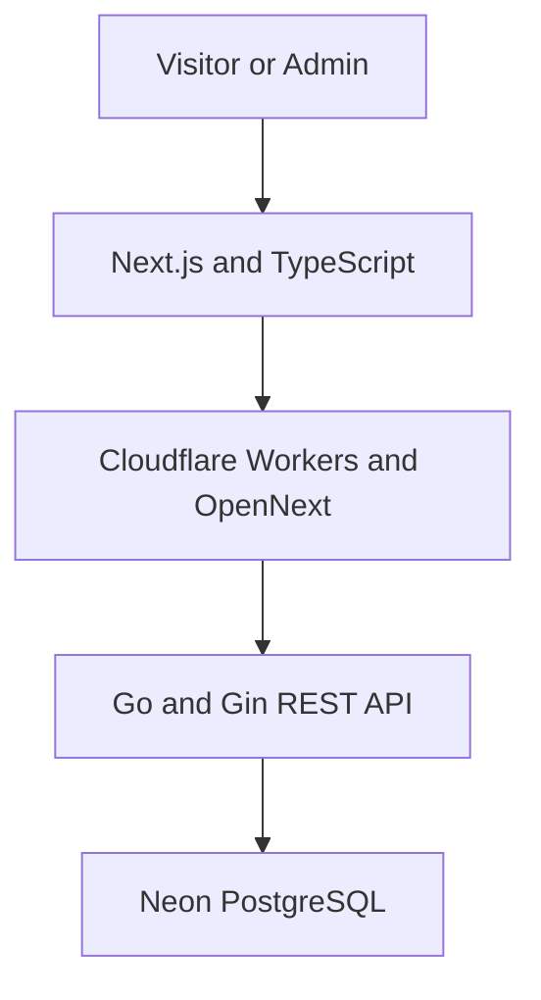
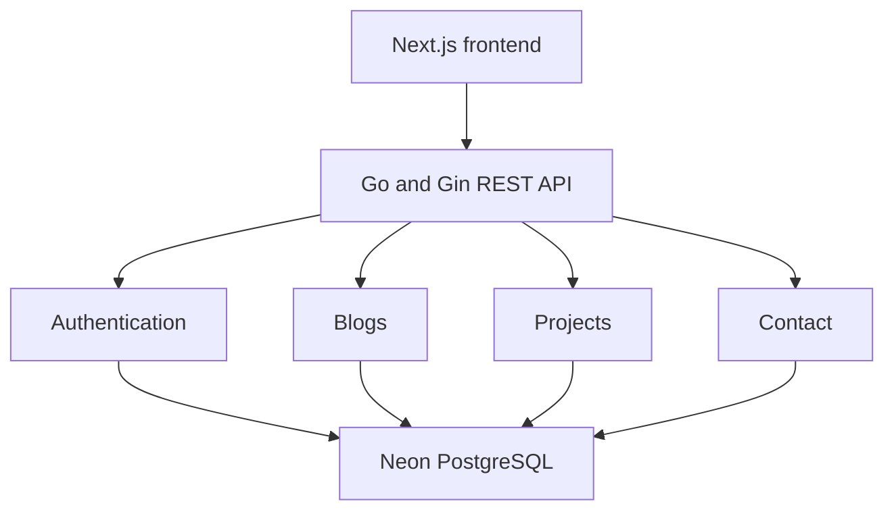
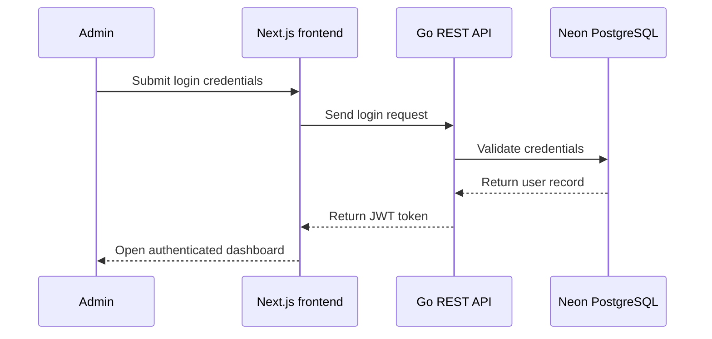
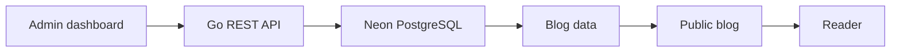
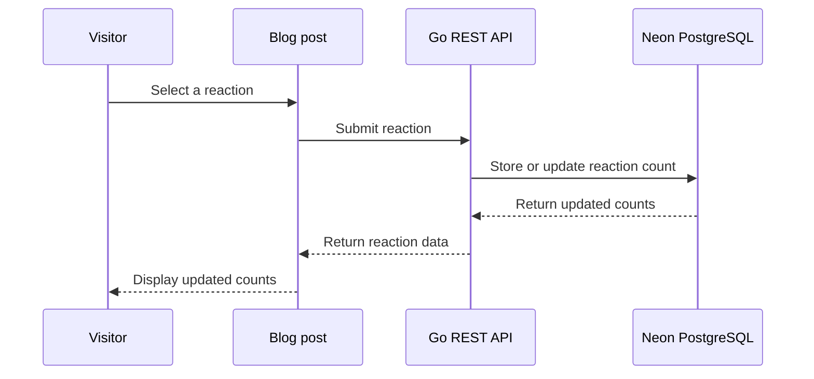
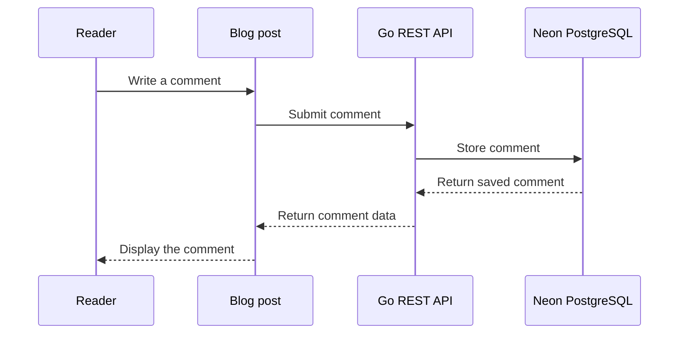
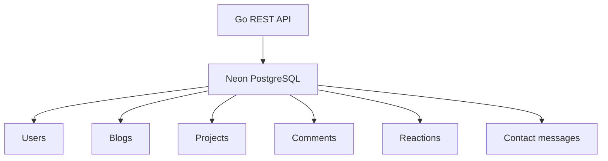
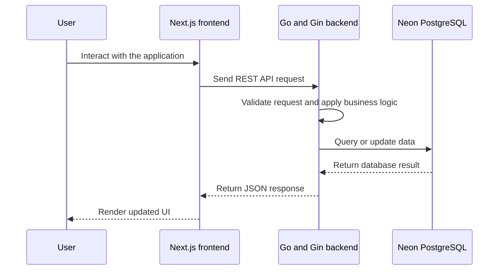
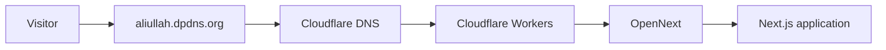
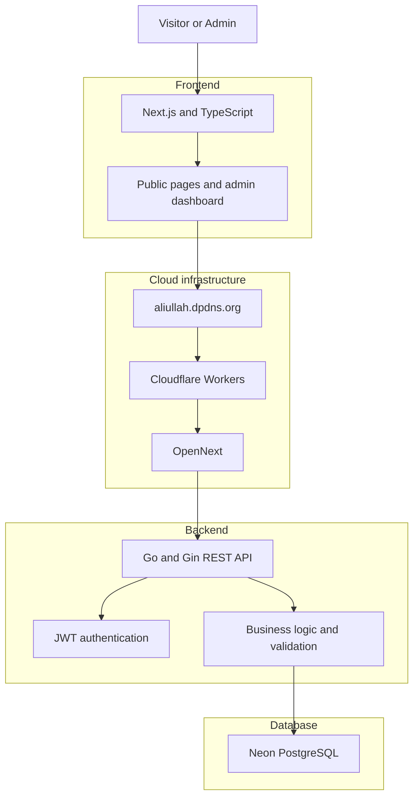

# Building My Personal Portfolio Platform

A technical overview of my full-stack portfolio platform built with Next.js, Go, PostgreSQL, Cloudflare Workers, and OpenNext.

**Published:** August 27, 2026  
**Reading time:** 5 min read

**Reactions:** Like 6 | Dislike 0 | Care 1 | Love 3

## 1. The Idea

I wanted to build more than a traditional static portfolio.

The goal was to create a **production-oriented, content-driven platform** where I can showcase my professional identity, projects, technical articles, skills, and achievements while continuously updating content through an admin dashboard.

The platform focuses on:

- Professional presentation
- Real-world engineering practices
- Content management
- Interactive technical blogging
- Scalable architecture

## 2. Platform Overview

The platform follows a layered full-stack architecture:

The frontend, backend, database, and infrastructure are separated so each layer has a clear responsibility.

## 3. Frontend

The frontend is built with Next.js and TypeScript. It provides a responsive experience across desktop and mobile devices.

Main sections include:

- Home
- About
- Skills
- Experience
- Projects
- Blog
- Contact
- Authentication
- Admin dashboard

The frontend communicates with the backend through REST APIs and native `fetch` requests. It does not access the database directly.

## 4. Backend

The backend is developed using Go and Gin. It provides a dedicated REST API between the frontend and database.

The backend is responsible for:

- Authentication
- Authorization
- Blog operations
- Project operations
- Contact messages
- Request validation
- Business logic
- Database operations

This separation keeps business logic independent from the frontend presentation layer.

## 5. Authentication and Authorization

The admin system uses JWT-based authentication.

The authentication flow is:

Protected API endpoints use authentication middleware to verify the JWT before processing requests. This ensures that administrative operations are restricted to authenticated users.

## 6. Admin Dashboard

The platform includes a custom admin dashboard for managing portfolio content.

The purpose is to make the platform content-driven instead of code-driven.

The dashboard currently supports management of:

- Blog posts
- Projects
- Profile information
- Messages

Content can be created, updated, published, or managed without modifying the frontend source code for every change.

## 7. Blog Management System

The blog system is designed for publishing technical articles and development insights.

Each blog post contains structured metadata and publishing information.

### Basics

- **Title:** The main title displayed for the article.
- **Slug:** A unique URL-friendly identifier used to access the post.

### Content

- **Excerpt:** A short summary displayed in blog listings and previews.
- **Content:** The complete article content written in Markdown.
- **Cover image:** The primary visual used for the article.

Markdown allows articles to contain:

- Headings
- Paragraphs
- Lists
- Links
- Images
- Code snippets
- Technical explanations
- Structured sections

### SEO Metadata

- **Meta title:** An SEO-friendly title for search engines.
- **Meta description:** A short description used in search results.

### Publishing

- **Status:** Controls whether the article is Draft, Published, or Archived.
- **Category:** Groups articles by topic.
- **Tags:** Adds multiple topic labels for better organization.
- **Published at:** Defines the publication date and time.
- **Featured post:** Allows important articles to be highlighted.
- **Allow comments:** Controls whether visitors can comment on the article.

## 8. Blog Publishing Flow

The complete publishing flow is:

This allows me to create, edit, publish, archive, and manage articles without redeploying the frontend application.

## 9. Interactive Blog Experience

The blog is designed to be more than a simple article-reading system.

Visitors can interact with blog posts using the following reactions:

- Love
- Like
- Dislike
- Care

The interaction flow is:

This provides feedback about how readers respond to technical content.

## 10. Comments and Discussions

Visitors can also participate in discussions when comments are enabled for a post.

The comment system allows readers to:

- Share opinions
- Ask technical questions
- Discuss the article
- Provide feedback

The basic flow is:

This transforms the blog into a more interactive and community-oriented knowledge-sharing platform.

## 11. Project Showcase

The projects section focuses on both the product and the engineering behind it.

Projects can showcase:

- Project overview
- Problem being solved
- Key features
- Technology stack
- Engineering decisions
- GitHub repository
- Live demo
- Technical implementation details

The objective is not only to show what I built, but also to explain how and why I built it.

## 12. Database

The platform uses PostgreSQL, hosted on Neon.

The database provides structured relational storage for application data such as:

- Users
- Blog posts
- Projects
- Comments
- Reactions
- Contact messages

Using PostgreSQL provides a structured foundation for managing relationships between different parts of the platform.

## 13. Frontend-to-Backend Request Flow

A typical application request follows this flow:

The frontend never communicates directly with the database. This keeps the application architecture clean and makes the backend responsible for business rules and data access.

## 14. Cloud Infrastructure

The production frontend is deployed using Cloudflare Workers with OpenNext.

The production domain is:

**[aliullah.dpdns.org](https://aliullah.dpdns.org)**

Cloudflare is responsible for:

- DNS
- HTTPS
- Edge delivery
- Domain routing
- Production traffic
- Worker deployment

The frontend deployment flow is:

The backend remains a separate service and is accessed by the frontend through REST APIs.

## 15. Complete Production Architecture

The complete production architecture connects all major layers:

Each layer has a specific responsibility, making the system easier to maintain, debug, and extend.

## 16. Engineering Principles

While building the platform, I focused on practical software engineering principles:

- Separation of concerns
- API-driven architecture
- Type-safe development
- Reusable components
- Secure authentication
- Responsive UI
- Maintainable code structure
- Structured database design
- Content-driven architecture
- Cloud-ready deployment

The architecture is designed to evolve as the platform grows.

## 17. Future Improvements

The platform is continuously evolving.

Planned improvements include:

- Article bookmarking
- Newsletter subscriptions
- Reading history
- Advanced analytics
- AI-powered content recommendations
- Skills management
- Experience management
- Education management
- Certificate management
- More advanced content management features

These improvements will gradually transform the portfolio into a more complete professional platform.

## 18. Final Thoughts

This project started as a personal portfolio but gradually evolved into a complete full-stack platform.

Building it gave me the opportunity to work across the entire application lifecycle, from frontend development and REST API design to authentication, database architecture, content management, and cloud deployment.

The platform is both my professional online presence and a living demonstration of how I design, build, and evolve modern software systems.
